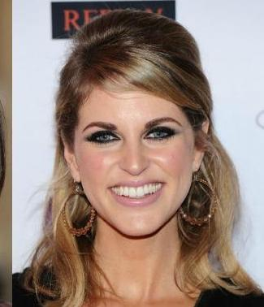

**Abstract:**
Nowadays, talking head techniques are widely researched. Most of the previous works pay attention to the association between tones, prosody, and visual cues, such as head motion, lip movement, and gestures. However, it is also important to concern with the timbre, matching the voice with the speaker identity, since people obtain speaker-specific information from both the auditory and visual modalities.
Thus in this paper, we aim to generate proper voice characteristics in accordance with the speaker characteristics we set up.
To address the problem, we first select 6 speaker characteristics related to the voice qualities: gender, age, race, body mass index, face shape, and personality. We then train a Conditional Variational AutoEncoder with attention (attentionCVAE) model to inference speaker embeddings from speaker characteristics and employ a multi-speaker text-to-speech system to generate speeches of nonexistent speakers we set.
The subjective tests indicate that our method can reconstruct real-world speaker embedding, and generate meaningful fake embeddings from speaker characteristics. The further analysis uncovers how and to what extent the speaker characteristics influence the voice qualities of speakers.

## Comparison with Baselines(Section 5.5)
These samples as corresponding to Section 5.5 in our paper. **LibriTTS** is the original TTS training dataset; **Voxceleb2** is unseen during TTS training and we train the next two models on this dataset; we train **MAF** and **attentionCVAE** to generate embedding from fake characteristic labels. We randomly select 4 samples for each respectively.

### LibriTTS
<audio controls>
  <source src="./audio/baselines/2532_157475.wav" type="audio/wav">
Your browser does not support the audio element.
</audio>
<audio controls>
  <source src="./audio/baselines/5126_34483.wav" type="audio/wav">
Your browser does not support the audio element.
</audio>
<audio controls>
  <source src="./audio/baselines/7777_106366.wav" type="audio/wav">
Your browser does not support the audio element.
</audio>
<audio controls>
  <source src="./audio/baselines/8677_246948.wav" type="audio/wav">
Your browser does not support the audio element.
</audio>

### VoxCeleb2
<audio controls>
  <source src="./audio/baselines/id00053.wav" type="audio/wav">
Your browser does not support the audio element.
</audio>
<audio controls>
  <source src="./audio/baselines/id03784.wav" type="audio/wav">
Your browser does not support the audio element.
</audio>
<audio controls>
  <source src="./audio/baselines/id05354.wav" type="audio/wav">
Your browser does not support the audio element.
</audio>
<audio controls>
  <source src="./audio/baselines/id07232.wav" type="audio/wav">
Your browser does not support the audio element.
</audio>

### MAF
<audio controls>
  <source src="./audio/baselines/maf_sample1.wav" type="audio/wav">
Your browser does not support the audio element.
</audio>
<audio controls>
  <source src="./audio/baselines/maf_sample2.wav" type="audio/wav">
Your browser does not support the audio element.
</audio>
<audio controls>
  <source src="./audio/baselines/maf_sample3.wav" type="audio/wav">
Your browser does not support the audio element.
</audio>
<audio controls>
  <source src="./audio/baselines/maf_sample4.wav" type="audio/wav">
Your browser does not support the audio element.
</audio>

### attentionCVAE(ours)
<audio controls>
  <source src="./audio/baselines/cvae_sample1.wav" type="audio/wav">
Your browser does not support the audio element.
</audio>
<audio controls>
  <source src="./audio/baselines/cvae_sample2.wav" type="audio/wav">
Your browser does not support the audio element.
</audio>
<audio controls>
  <source src="./audio/baselines/cvae_sample3.wav" type="audio/wav">
Your browser does not support the audio element.
</audio>
<audio controls>
  <source src="./audio/baselines/cvae_sample4.wav" type="audio/wav">
Your browser does not support the audio element.
</audio>

## Face Matching Test(Section 5.7)
We randomly select 3 seen speakers and 3 unseen speakers during training from VoxCeleb2 respectively. We respectively generate speech from their speaker embedding extracted from their audio and the embedding predicted from our model, and compare to what extent these speech match the speaker's face.

### seen speakers
id05663


ground truth:
<audio controls>
  <source src="./audio/faceMatch/id05663.wav" type="audio/wav">
Your browser does not support the audio element.
</audio>
ours:
<audio controls>
  <source src="./audio/faceMatch/id05663_fake.wav" type="audio/wav">
Your browser does not support the audio element.
</audio>

id07017


ground truth:
<audio controls>
  <source src="./audio/faceMatch/id07017.wav" type="audio/wav">
Your browser does not support the audio element.
</audio>
ours:
<audio controls>
  <source src="./audio/faceMatch/id07017_fake.wav" type="audio/wav">
Your browser does not support the audio element.
</audio>

id07254


ground truth:
<audio controls>
  <source src="./audio/faceMatch/id07254.wav" type="audio/wav">
Your browser does not support the audio element.
</audio>
ours:
<audio controls>
  <source src="./audio/faceMatch/id07254_fake.wav" type="audio/wav">
Your browser does not support the audio element.
</audio>


### unseen speakers
id00425



ground truth:
<audio controls>
  <source src="./audio/faceMatch/id00425.wav" type="audio/wav">
Your browser does not support the audio element.
</audio>
ours:
<audio controls>
  <source src="./audio/faceMatch/id00425_fake.wav" type="audio/wav">
Your browser does not support the audio element.
</audio>

id00467


ground truth:
<audio controls>
  <source src="./audio/faceMatch/id00467.wav" type="audio/wav">
Your browser does not support the audio element.
</audio>
ours:
<audio controls>
  <source src="./audio/faceMatch/id00467_fake.wav" type="audio/wav">
Your browser does not support the audio element.
</audio>


id01590


ground truth:
<audio controls>
  <source src="./audio/faceMatch/id01590.wav" type="audio/wav">
Your browser does not support the audio element.
</audio>
ours:
<audio controls>
  <source src="./audio/faceMatch/id01590_fake.wav" type="audio/wav">
Your browser does not support the audio element.
</audio>


## Header 2

> This is a blockquote following a header.
>
> When something is important enough, you do it even if the odds are not in your favor.

### Header 3

```js
// Javascript code with syntax highlighting.
var fun = function lang(l) {
  dateformat.i18n = require('./lang/' + l)
  return true;
}
```

```ruby
# Ruby code with syntax highlighting
GitHubPages::Dependencies.gems.each do |gem, version|
  s.add_dependency(gem, "= #{version}")
end
```

#### Header 4

*   This is an unordered list following a header.
*   This is an unordered list following a header.
*   This is an unordered list following a header.

##### Header 5

1.  This is an ordered list following a header.
2.  This is an ordered list following a header.
3.  This is an ordered list following a header.
<audio controls>
  <source src="./assets/images/f_<30_<25.wav" type="audio/wav">
Your browser does not support the audio element.
</audio>
<audio controls>
  <source src="./assets/images/f_<30_<25.wav" type="audio/wav">
Your browser does not support the audio element.
</audio>

<audio controls>
  <source src="./assets/images/f_<30_<25.wav" type="audio/wav">
Your browser does not support the audio element.
</audio>

###### Header 6

| head1        | head two          | three |
|:-------------|:------------------|:------|
| ok           | good swedish fish | nice  |
| out of stock | good and plenty   | nice  |
| ok           | good `oreos`      | hmm   |
| ok           | good `zoute` drop | yumm  |

### There's a horizontal rule below this.

* * *

### Here is an unordered list:

*   Item foo
*   Item bar
*   Item baz
*   Item zip

### And an ordered list:

1.  Item one
1.  Item two
1.  Item three
1.  Item four

### And a nested list:

- level 1 item
  - level 2 item
  - level 2 item
    - level 3 item
    - level 3 item
- level 1 item
  - level 2 item
  - level 2 item
  - level 2 item
- level 1 item
  - level 2 item
  - level 2 item
- level 1 item

### Small image


### Large image


### Definition lists can be used with HTML syntax.

<dl>
<dt>Name</dt>
<dd>Godzilla</dd>
<dt>Born</dt>
<dd>1952</dd>
<dt>Birthplace</dt>
</dl>

```
Long, single-line code blocks should not wrap. They should horizontally scroll if they are too long. This line should be long enough to demonstrate this.
```

```
The final element.
```
